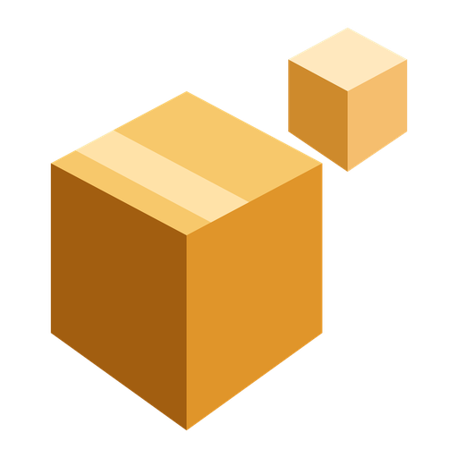
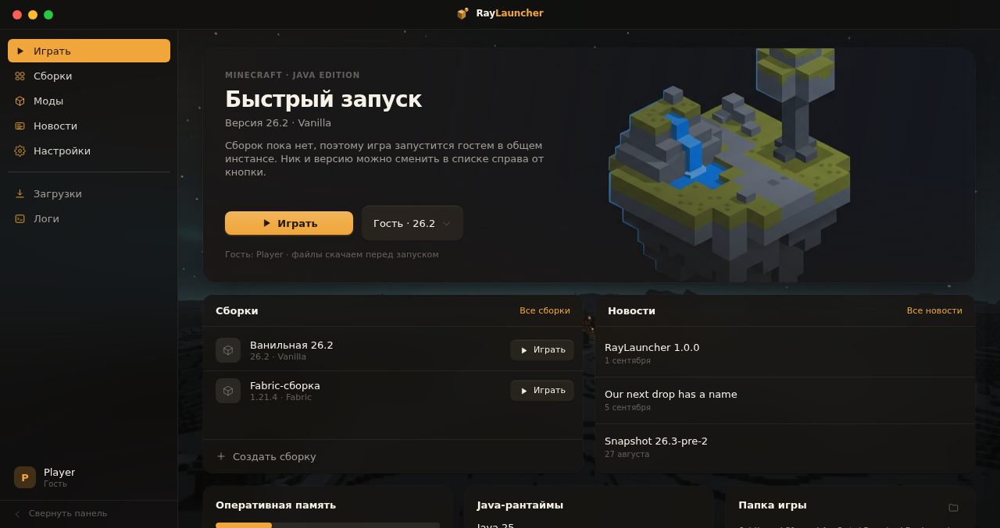
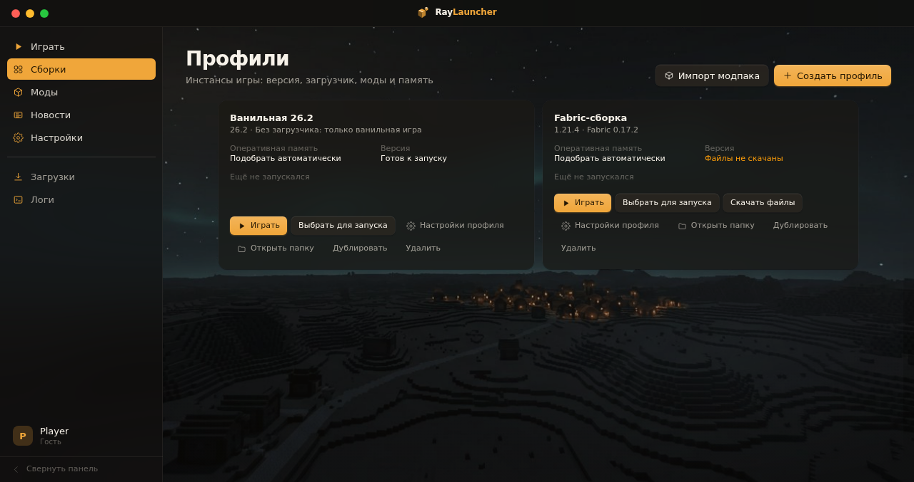
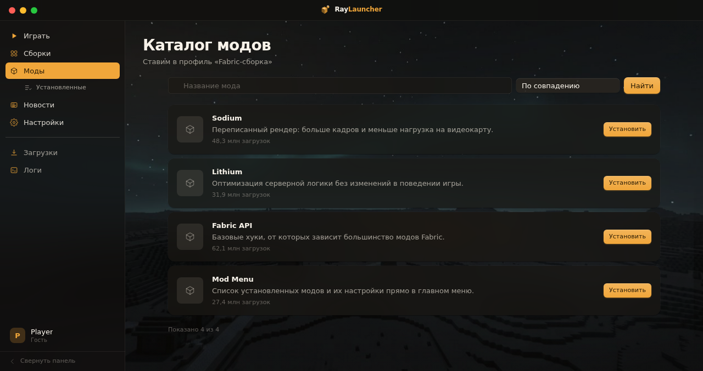
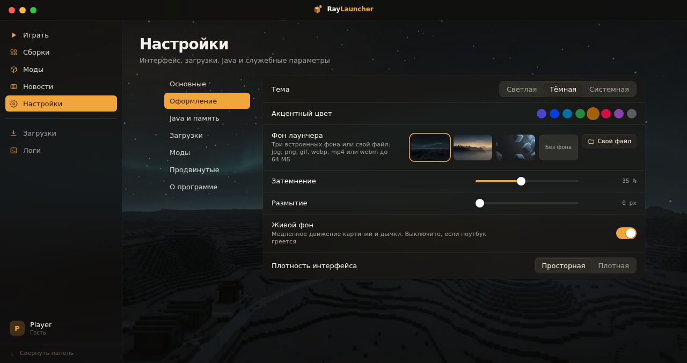

<div align="center">



# RayLauncher

**Лаунчер Minecraft Java Edition для Windows.**
Скачивание и запуск игры написаны с нуля по манифестам Mojang..


</div>



## Что это

RayLauncher качает клиент, библиотеки, ассеты и нужную версию Java по манифестам Mojang. Командную строку собирает сам. За игрой следит от запуска до отчёта о падении.

У каждой сборки своя папка: моды, миры, конфиги, логи. Версии, библиотеки, ассеты и рантаймы общие — второй профиль на той же версии почти ничего не занимает.

Интерфейс на русском, английский переключается в настройках. Главный процесс не блокируется: SHA1 и распаковка идут в отдельных воркерах.

## Что умеет

**Запуск и сборки**
- Все версии Mojang с фильтром «релизы / снапшоты / всё», установка кнопкой.
- Профили-инстансы: своя память, свой Java, свои аргументы JVM и игры, свои папки `mods`, `saves`, `config`, `resourcepacks`, `shaderpacks`.
- Загрузчики: Fabric, Quilt, NeoForge, Forge. Версии берутся из их метаданных, Forge ставится своим установщиком в отдельном процессе.
- Java подбирается по `javaVersion.component` из версии игры и качается сама. Можно указать свой `java.exe`.
- Лог игры разбирается на лету: готовность клиента, предупреждения, падение, `UnsupportedClassVersionError`. При крэше лаунчер находит свежий отчёт и достаёт причину.

**Аккаунты**
- Microsoft: Authorization Code Flow с PKCE, редирект на `127.0.0.1`, дальше XBL → XSTS → Minecraft Services. Коды `XErr` переводятся в понятные причины: нет профиля Xbox, детская учётка, закрытый регион.
- Свои серверы: Yggdrasil и authlib-injector. Если персонажей несколько — лаунчер спросит, каким играть.
- Гость с офлайн-UUID v3 от `OfflinePlayer:{ник}` — такой же, как у ванильного сервера в офлайне.
- Токены лежат в `safeStorage`. В renderer не уходит ни один секрет, в логах они маскируются.
- Скины: просмотр в 3D, свой PNG 64×64, модели Steve и Alex. Локальный Yggdrasil отдаёт скин гостю без интернета.

**Моды**
- Modrinth работает сразу, CurseForge — по личному ключу API.
- Зависимости разрешаются рекурсивно. Обязательные ставятся сами, конфликт блокирует установку и называет виновника, циклы обрываются.
- Обновления ищутся по SHA1 файлов. Поэтому находятся и моды, скачанные вручную мимо лаунчера.
- Модпаки `.mrpack` и CurseForge ставятся вместе с `overrides` — всегда в новый профиль.
- Выключенный мод переименовывается в `.jar.disabled`, файл остаётся на месте.

**Интерфейс**
- Экран «Играть»: карточка запуска, список сборок, свежие новости, память, Java и папка игры.
- Фон: три встроенных или свой файл — jpg, png, webp, gif, avif, mp4, webm. Настраиваются затемнение, размытие и анимация.
- Две темы, восемь акцентов, палитра команд по <kbd>Ctrl</kbd>+<kbd>K</kbd>, консоль игры с любой страницы.
- Новости Minecraft и релизы лаунчера в одной ленте. Markdown проходит через `sanitize-html`.
- Автообновление на `electron-updater`: проверяет само, качает по кнопке, ставит при выходе.

## Скриншоты

| Сборки | Каталог модов | Оформление |
|---|---|---|
|  |  |  |

## Стек

| Слой | Технологии |
|---|---|
| Оболочка | Electron 44.2, electron-vite 5, electron-builder 26 |
| Интерфейс | React 19, React Router 7, Zustand 5, Tailwind CSS 4, Framer Motion 13 |
| Данные | `node:sqlite`, electron-store, `safeStorage` |
| Сервис | electron-log, electron-updater, zod 4, sanitize-html, yauzl |
| Качество | TypeScript 5.9 strict, ESLint 10, Vitest 4 |

## Запуск

Нужны Windows 10/11 и Node.js 20.19+.

```bash
git clone https://github.com/<владелец>/<репозиторий>.git
cd raylauncher
npm install
npm run dev
```

Нативных модулей нет, Build Tools ставить не придётся.

Интерфейс можно крутить без Electron: `npm run dev:web` поднимает renderer на `http://localhost:5199`, IPC там заменён моками.

## Команды

| Команда | Что делает |
|---|---|
| `npm run dev` | Electron с горячей перезагрузкой renderer |
| `npm run dev:web` | только интерфейс в браузере, IPC на моках |
| `npm run typecheck` | `tsc` по двум проектам: main + preload + tests и renderer |
| `npm run lint` | ESLint |
| `npm run test` | Vitest, 232 теста в 17 файлах |
| `npm run build` | typecheck и сборка в `out/` |
| `npm run build:win` | NSIS-установщики x64 и arm64 в `release/` |

## Сборка установщика

```bash
npm run build:win                                                    # x64 + arm64
npx electron-builder --win --x64 --publish never -c.win.target=nsis  # только x64
```

| Файл в `release/` | Что это |
|---|---|
| `RayLauncher-<версия>-x64.exe` | установщик для Intel и AMD, ~116 МБ |
| `RayLauncher-<версия>-arm64.exe` | установщик для Windows on ARM, ~110 МБ |
| `latest.yml`, `*.blockmap` | манифест и карта блоков для `electron-updater` |

Установщик кладёт приложение в `%LOCALAPPDATA%\Programs\raylauncher`, прав администратора не просит, даёт выбрать каталог, делает ярлыки и связывает файлы `.mrpack`. Данные игры лежат отдельно в `%APPDATA%\RayLauncher` и после удаления лаунчера остаются.

Собирать под Windows можно и на Linux. Тогда нужен `wine` — в Debian это пакеты `wine` и `wine32:i386`, иначе NSIS не соберёт деинсталлятор.

## Автообновление

1. Впишите свой репозиторий в `electron-builder.yml`:

   ```yaml
   publish:
     provider: github
     owner: <владелец>
     repo: <репозиторий>
   ```

2. Поднимите версию в `package.json`. Обновление предлагается, только когда версия релиза больше установленной.
3. Опубликуйте: `set GH_TOKEN=...`, затем `npm run build:win -- --publish always`.

В релизе должны лежать `*.exe`, `latest.yml` и `*.blockmap`. Без манифеста лаунчер обновление не увидит. Без blockmap не сможет докачать только изменившиеся куски и потянет все 116 МБ заново.

Канал `beta` в настройках включает пререлизы.

Проверить всё это до публикации: скопируйте `dev-app-update.yml.example` в `dev-app-update.yml`, занизьте версию в `package.json` и запустите `set RAY_UPDATER_DEV=1 && npm run dev`.

## Как устроено

```
src/
  shared/     контракт IPC, доменные типы, zod-схемы, коды ошибок, константы API
  main/       окно, логгер, настройки, БД, воркеры, minecraft/, auth/, mods/, news/, updater/
  preload/    единственный мост contextBridge → window.ray
  renderer/   React: токены Tailwind, i18n, zustand-сторы, страницы и компоненты
tests/        Vitest, только чистые модули без Electron
scripts/      генерация логотипа и служебные утилиты
buildAssets/  иконка, картинки и скрипт NSIS для electron-builder
docs/         скриншоты для README
```

Правила, которых держится код:

- **Один контракт на IPC.** `src/shared/ipc.ts` описывает каждый канал, `src/shared/schemas.ts` — zod-схему его входа. Обработчик без схемы не зарегистрируется.
- **Main не блокируется.** SHA1 и распаковка уходят в `utilityProcess`-воркеры, загрузки идут через общую очередь с ограничением параллелизма и докачкой.
- **Никакого semver для версий Minecraft.** Порядок берётся из манифеста, а не из разбора строк вроде `1.21.5-pre2`.
- **Ошибки типизированы.** `RayError { code, message, details }` летит через IPC, а в человеческий текст превращается уже в renderer.
- **Комментариев в коде нет.** Имена функций и типов объясняют себя сами. Исключение — директивы вроде `eslint-disable-next-line`.

## Безопасность

- `nodeIntegration: false`, `contextIsolation: true`, `sandbox: true`, `webSecurity: true`.
- CSP без `unsafe-eval`. `eval` и `new Function` не используются нигде.
- Наружу renderer ходит только через `window.ray`, каждый вход проверяет zod.
- Внешние ссылки открываются в системном браузере и только по белому списку доменов.
- Секреты — в `safeStorage`. Токены в логах маскируются, файлы ротируются по 10 МБ × 5.
- Свой фон отдаётся по схеме `ray-bg://` из отдельного каталога, выход за его пределы закрыт.

## Данные на диске

```
%APPDATA%\RayLauncher\
  config.json         настройки
  ray.db              профили, моды, кэш
  backgrounds\        свой фон пользователя
  logs\               логи лаунчера
  games\
    versions\ libraries\ assets\ jre\   общие для всех сборок
    instances\{profileId}\               своя папка каждой сборки
```

Удаление лаунчера папку с играми не трогает.

## Тесты

```bash
npm run test
```

232 теста в 17 файлах на чистую логику: правила библиотек, слияние `inheritsFrom`, аргументы и classpath, пути Windows, разбор лога и крэш-репорта, офлайн-UUID, PKCE, метаданные загрузчиков, резолвер зависимостей, санитайзер Markdown, нечёткий поиск, лента новостей. Electron в тестах не поднимается.

## Оформление

Логотип рисуется кодом: `python3 scripts/make-logo.py` собирает `icon.ico` из девяти размеров, `icon.png` и картинки инсталлятора. В интерфейсе тот же знак — SVG-компонент, который красится от текущего акцента.

Палитра тёплая: графит и янтарь по умолчанию, плюс семь других акцентов и светлая тема. Когда фон включён, панели становятся полупрозрачными; выключите фон — вернутся плотные поверхности.

## Чего пока нет

- Установщик не подписан. При первом запуске Windows покажет предупреждение SmartScreen.
- Интерфейс тестами не покрыт — тесты только на логику.
- Сборка под arm64 собирается, но на живом ARM-устройстве её не проверяли.
- Нет экспорта сборки в `.mrpack` и синхронизации настроек между машинами.

## Лицензия

[MIT](./LICENSE).

Проект не связан с Mojang Studios и Microsoft. Minecraft — товарный знак Mojang Studios. Лаунчер использует только официальные публичные API.
